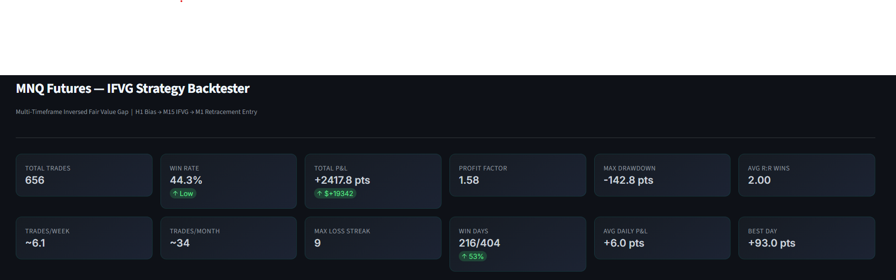
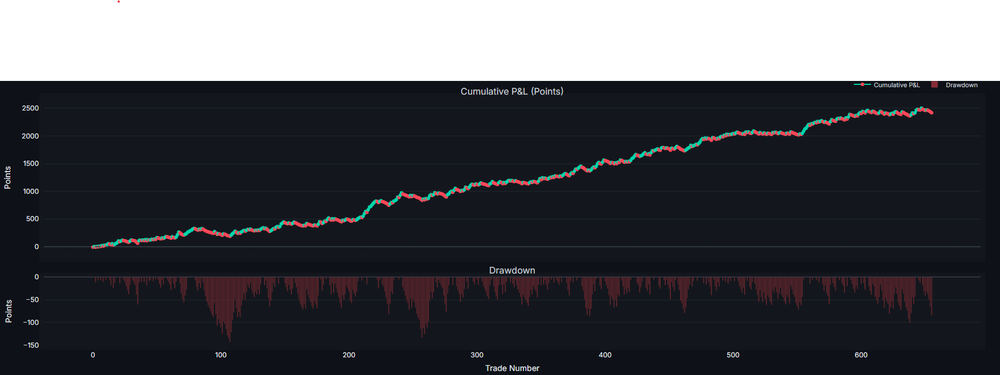
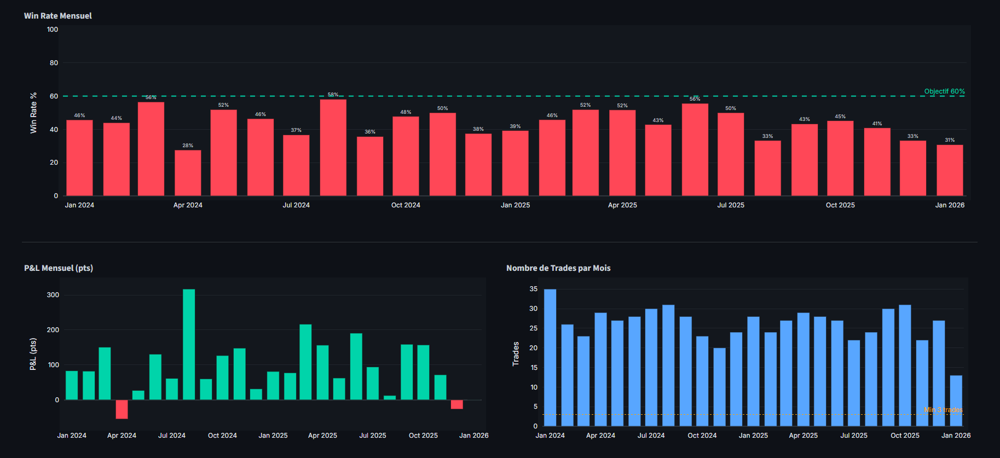
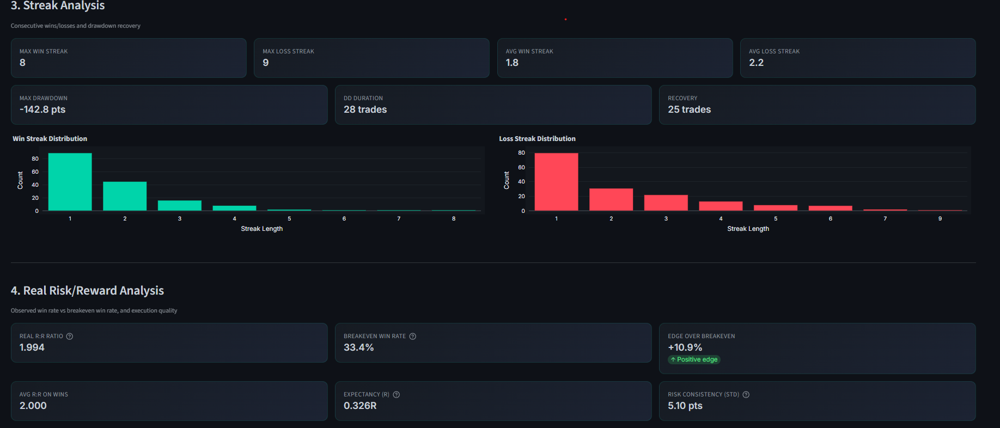

# MNQ IFVG Strategy Backtester & Quant Research Framework

Framework de recherche quantitative et de backtesting développé en Python permettant d’analyser, optimiser et évaluer une stratégie algorithmique multi-timeframe sur les futures MNQ (Micro E-mini Nasdaq-100).

Le projet combine :

- détection algorithmique de structures de marché ;
- génération de signaux IFVG ;
- moteur de backtesting ;
- gestion du risque ;
- analyse statistique avancée ;
- optimisation paramétrique ;
- dashboard interactif Streamlit.

---

# Aperçu du projet

L’objectif du projet est de construire un environnement de recherche quantitatif complet autour d’une stratégie discrétionnaire transformée en logique algorithmique.

Le framework permet notamment :

- le chargement et le nettoyage de données futures MNQ ;
- la sélection automatique du contrat actif ;
- l’analyse multi-timeframe ;
- la détection algorithmique de signaux IFVG ;
- la génération de trades ;
- l’évaluation statistique des performances ;
- l’optimisation des paramètres de stratégie ;
- l’étude de la robustesse mensuelle et annuelle.

Le moteur a été conçu dans une logique de recherche empirique et d’itérations successives.

---

# Pipeline du framework

```text
Données Futures MNQ
        ↓
Préparation & nettoyage
        ↓
Sélection du contrat actif
        ↓
Analyse multi-timeframe
        ↓
Détection IFVG
        ↓
Filtres de marché & confirmations
        ↓
Gestion du risque
        ↓
Backtesting
        ↓
Analyse statistique
        ↓
Optimisation paramétrique
        ↓
Dashboard & visualisation
```

---

# Fonctionnalités principales

## Backtesting algorithmique

- moteur de backtesting custom en Python ;
- gestion des entrées/sorties ;
- gestion du risque par trade ;
- take profit / stop loss ;
- break-even automatique ;
- trailing stop dynamique ;
- limitation du nombre de trades par session ;
- cooldown entre trades.

---

# Dashboard

## Dashboard principal



---

## Equity Curve



---

## Analyse mensuelle



---

## Analyse des drawdowns



---

# Confidentialité de la stratégie

Certaines parties liées à la logique exacte de génération des signaux et à des éléments propriétaires de la stratégie ne sont volontairement pas publiées.

Le repository public présente principalement :

- l’architecture du framework ;
- les outils analytiques ;
- les visualisations ;
- les résultats statistiques.

---

# Auteur

Antoine Borie

- LinkedIn : www.linkedin.com/in/antoine-borie
- Email : borie@et.esiea.fr